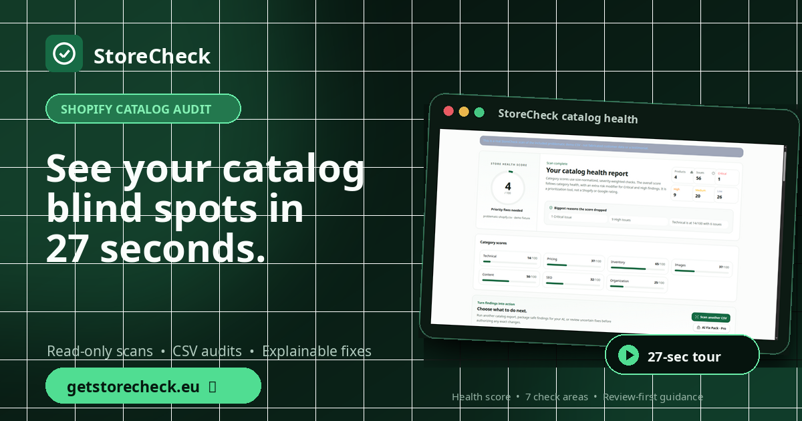
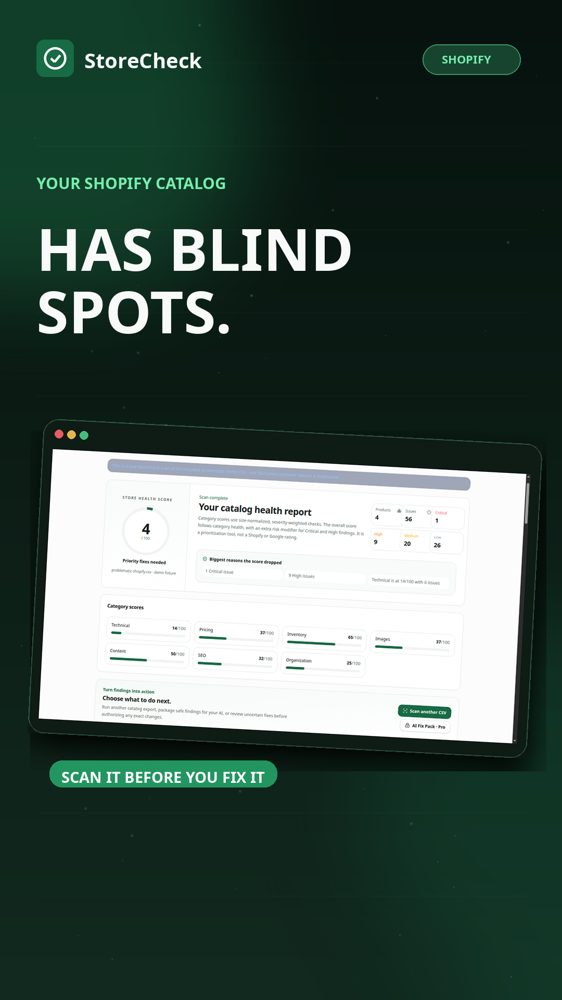
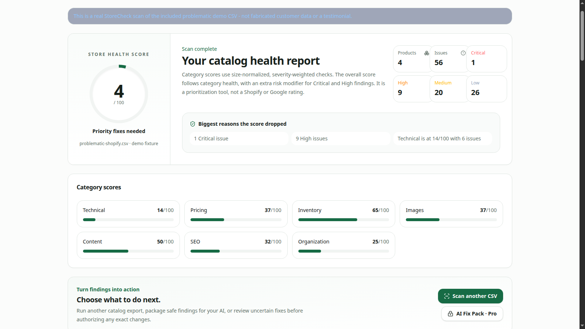
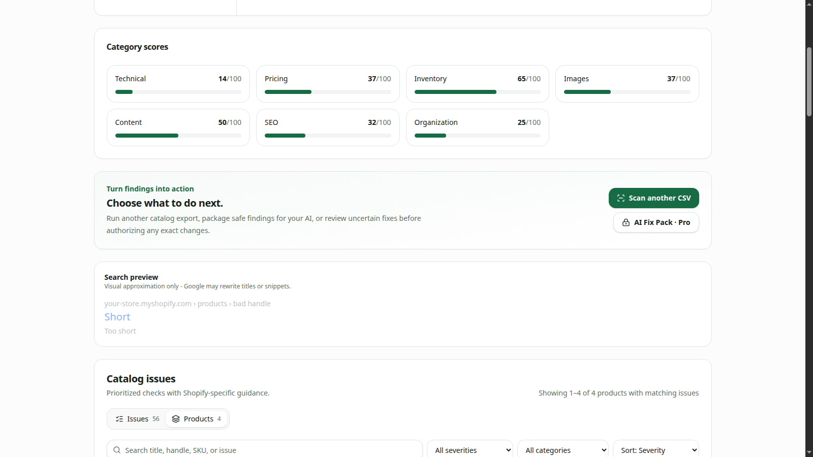
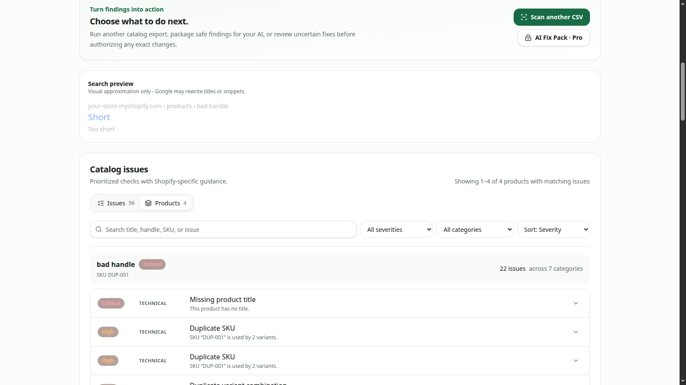

# StoreCheck — Shopify catalog health audit

**[Open StoreCheck](https://getstorecheck.eu)** · **[Try the interactive demo](https://getstorecheck.eu/demo)** · **[Watch the 27-second product tour](https://soccervortex.github.io/storecheck-shopify-catalog-audit/)** · **[Download Promo Kit v1.1](https://github.com/soccervortex/storecheck-shopify-catalog-audit/releases/tag/promo-kit-v1.1)**

StoreCheck is a review-first Shopify catalog auditor. It turns product data into an explainable health score, seven category scores, severity-ranked findings, affected products, evidence, and fix guidance without silently writing changes back to a connected store.

## What you can audit

StoreCheck checks catalog quality across seven areas:

| Area | Examples |
| --- | --- |
| **Technical** | handles, SKUs, variant structure, duplicate identifiers |
| **Pricing** | invalid values, compare-at pricing, sibling price gaps |
| **Inventory** | tracked quantities, negative stock, policy consistency |
| **Images** | missing media, invalid URLs, alt-text gaps, suspicious reuse |
| **Content** | missing/thin titles and descriptions, duplicate or highly similar copy |
| **SEO** | missing, duplicate, unusually short or long SEO titles/descriptions |
| **Organization** | vendors, product types, tags, casing and formatting drift |

Merchants can either connect an owned Shopify store for a **read-only live scan** or upload a Shopify product CSV.

## 27-second product tour — caption-refined v1.1

The current promo master uses short phrase-level captions synchronized from the same voice-over word boundaries, positioned in a compact top-safe strip so the StoreCheck UI remains visible.

**[Watch the tour](https://soccervortex.github.io/storecheck-shopify-catalog-audit/)** · **[Watch on TikTok](https://www.tiktok.com/@getstorecheck/video/7676250181284777248)** · **[Watch on X](https://x.com/skinvaults/status/2090575900727193947)** · **[Promo Kit v1.1](https://github.com/soccervortex/storecheck-shopify-catalog-audit/releases/tag/promo-kit-v1.1)**

## Product screens

### Catalog health overview

### Seven category scores

### Explainable action guidance

## Review-first by design

Connected-store scans are read-only. StoreCheck does not silently update Shopify products through the Admin API.

The deterministic safe CSV cleanup path is deliberately narrow: it only handles proven duplicate/empty tag hygiene, verifies the exact source CSV, preserves product boundaries, and reparses/rescans the candidate output before download. Pricing, inventory, classification, identifiers, and merchant-specific content decisions remain review-first.

## Current Shopify catalog guides

- [Shopify product audit](https://getstorecheck.eu/shopify-product-audit)
- [Shopify product audit checklist](https://getstorecheck.eu/shopify-product-audit-checklist)
- [Shopify CSV audit](https://getstorecheck.eu/shopify-csv-audit)
- [Find duplicate Shopify SKUs](https://getstorecheck.eu/shopify-duplicate-skus)
- [Shopify product image and alt-text audit](https://getstorecheck.eu/shopify-product-image-audit)
- [Shopify SEO title and meta-description audit](https://getstorecheck.eu/shopify-seo-title-meta-audit)
- [Clean Shopify tags, vendors and product types](https://getstorecheck.eu/shopify-tags-vendors-product-types)
- [Shopify catalog health scorecard](https://getstorecheck.eu/shopify-catalog-health)
- [Shopify SEO audit](https://getstorecheck.eu/shopify-seo-audit)
- [Shopify catalog cleanup](https://getstorecheck.eu/shopify-catalog-cleanup)
- [Verify Shopify catalog cleanup before and after](https://getstorecheck.eu/shopify-catalog-cleanup-verification)
- [StoreCheck privacy](https://getstorecheck.eu/privacy)
- [Contact / support](https://getstorecheck.eu/contact)

## Repository scope

This repository is the public StoreCheck product showcase and promotional asset host. The application source code, production configuration, credentials, and private operational material are intentionally not published here.

Shopify is a trademark of Shopify Inc. StoreCheck is an independent product and is not endorsed by Shopify Inc.
